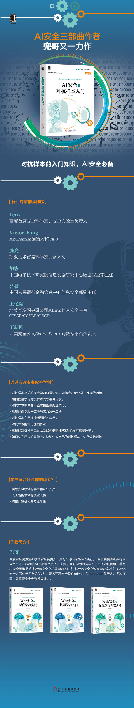

# 《AI安全之对抗样本入门》

# 编辑推荐
本书系统介绍对抗样本的基本原理，从相关的背景知识开始，包含搭建学习对抗样本的软硬件环境、常用工具，带领读者快速上手实践。本书作者在安全领域有多年实践经验，对业界常见的方法做了系统的归纳总结，包含大量案例，深入浅出，实践性强。

主要内容包括：

对抗样本相关的深度学习背景知识，如梯度、优化器、反向传递等。

如何搭建学习对抗样本的软硬件环境。

对抗样本领域的一些常见图像处理技巧。

常见的白盒攻击算法与黑盒攻击算法。

对抗样本在目标检测领域的应用。

对抗样本的常见加固算法。

常见的对抗样本工具以及如何搭建NIPS对抗样本竞赛环境。

如何站在巨人的肩膀上，快速生成自己的对抗样本，进行攻防对抗

# 内容简介

第1章介绍了深度学习的基础知识，重点介绍了与对抗样本相关的梯度、优化器、反向传递等知识点。

第2章介绍了如何搭建学习对抗样本的软硬件环境，虽然GPU不是必需的，但是使用GPU可以更加快速地验证你的想法。

第3章概括介绍了常见的深度学习框架，从TensorFlow、Keras、PyTorch到MXNet。

第4章介绍了图像处理领域的基础知识，这部分知识对于理解对抗样本领域的一些常见图像处理技巧非常有帮助。

第5章介绍了常见的白盒攻击算法，从基础的FGSM、DeepFool到经典的JSMA和CW。

第6章介绍了常见的黑盒攻击算法。

第7章介绍了对抗样本在目标识别领域的应用。

第8章介绍了对抗样本的常见抵御算法，与对抗样本一样，抵御对抗样本的技术也非常有趣。

第9章介绍了常见的对抗样本工具以及如何搭建NIPS 2017对抗防御环境和轻量级攻防对抗环境robust-ml，通过这章读者可以了解如何站在巨人的肩膀上，快速生成自己的对抗样本，进行攻防对抗。

# 作者简介
兜哥，百度安全实验室AI模型安全负责人，具有10余年安全从业经历，曾任百度基础架构安全负责人、Web安全产品线负责人。主要研究方向为对抗样本、生成对抗网络。著有AI安全畅销书籍《Web安全之机器学习入门》《Web安全之深度学习实战》《Web安全之强化学习与GAN》。著名开源AI安全工具箱AdvBox的作者，FreeBuf、雷锋网、安全客特邀专栏作家，知名安全自媒体“兜哥带你学安全”主编。

