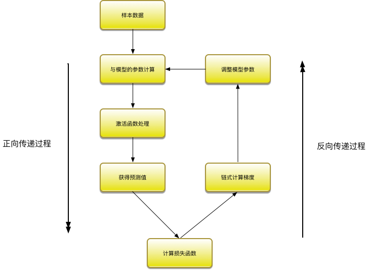
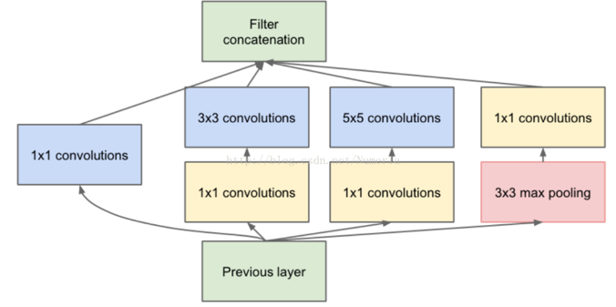
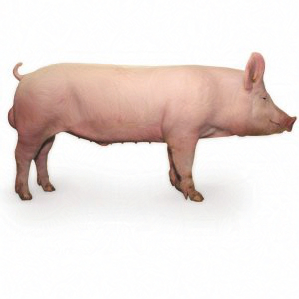

# 对抗样本的基本原理

## 概述
对抗样本是机器学习模型的一个有趣现象，攻击者通过在源数据上增加人类难以通过感官辨识到的细微改变，但是却可以让机器学习模型接受并做出错误的分类决定。一个典型的场景就是图像分类模型的对抗样本，通过在图片上叠加精心构造的变化量，在肉眼难以察觉的情况下，让分类模型产生误判。

在原理上介绍对抗样本，以经典的二分类问题为例，机器学习模型通过在样本上训练，学习出一个分割平面，在分割平面的一侧的点都被识别为类别一，在分割平面的另外一侧的点都被识别为类别二。

生成攻击样本时，我们通过某种算法，针对指定的样本计算出一个变化量，该样本经过修改后，从人类的感觉无法辨识，但是却可以让该样本跨越分割平面，导致机器学习模型的判定结果改变。

如何高效的生成对抗样本，且让人类感官难以察觉，正是对抗样本生成算法研究领域的热点。

## 梯度算法和损失函数
对抗样本其实对机器学习模型都有效，不过研究的重点还是在神经网络尤其是深度学习网络领域。理解对抗样本算法，需要一定的神经网络的知识。在深度学习模型里面，经常需要使用梯度算法，针对损失函数的反馈不断调整各层的参数，使得损失函数最小化。损失函数可以理解为理想和现实之间的差距，通常定义一个函数来描述真实值和预测值之间的差异，在训练阶段，真实值就是样本对应的真实标签和预测值就是机器学习模型预测的标签值，这些都是明确的，所以损失函数是可以定义和计算的。在分类问题中，常见的损失函数包括binary\_crossentropy和categorical\_crossentropy。

### binary_crossentropy
binary\_crossentropy亦称作对数损失,

### categorical_crossentropy
categorical\_crossentropy亦称作多类的对数损失

机器学习模型训练的过程就是不断调整参数追求损失函数最小的过程。梯度可以理解为多元函数的指定点上升的坡度。梯度可以用偏导数来定义，通常损失函数就是这个多元函数，特征向量就可以看成这个多元函数的某个点。在训练过程中，针对参数的调整可以使用梯度和学习率来定义，其中学习率也叫做学习步长，物理含义就是变量在梯度方向上移动的长度，学习率是一个非常重要的参数，过大会导致损失函数的震荡难以收敛，过小会导致计算缓慢，目前还没有很成熟的理论来推导最合适的学习率，经验值是0.001-0.1之间,迭代更新参数x的方法为：

$$ 
	x\_{k+1}=x\_k+\epsilon*grad(x)
$$

当我们求函数的最大值时，我们会向梯度向上的方向移动，所以使用加号，也成为梯度向上算法。如果我们想求函数的最小值时，则需要向梯度向下的方向移动，也成为梯度下降算法。所以使用减号，比如求损失函数最小值是，对应迭代求解的方法为：
$$ 
	x\_{k+1}=x\_k-\epsilon*grad(x)
$$
我们通过一个非常简单的例子演示这个过程，假设我们只有一个变量x，对应的损失函数定义为：
$$
f(x)=x^2+2
$$

根据梯度的定义，可以获得对应的梯度为：

$$
	grad(x)={\partial{f(x)}}/{\partial(x)}=2x
$$

我们随机初始化x，学习率设置为0.1，整个过程如下：
  
	def demo():
		import random
		a=0.1
		x=random.randint(1,10)
		y = x * x + 2
		index=1
		while index < 100 and abs(y-2) > 0.01 :
    		y=x*x+2
    		print "batch={} x={} y={}".format(index,x,y)
    		x=x-2*x*a
    		index+=1

整个迭代过程最多100步，由于我们预先知道函数的最小值为2，所以如果当计算获得的函数值非常接近2，我们也可以提前退出迭代过程，比如绝对值相差不超过0.01。最后果然没让我们失望，在迭代20次后就找到了接近理论上的最小点。

	batch=14 x=0.329853488333 y=2.10880332377
	batch=15 x=0.263882790666 y=2.06963412721
	batch=16 x=0.211106232533 y=2.04456584141
	batch=17 x=0.168884986026 y=2.02852213851
	batch=18 x=0.135107988821 y=2.01825416864
	batch=19 x=0.108086391057 y=2.01168266793
	batch=20 x=0.0864691128455 y=2.00747690748

Keras里面提供相应的工具返回loss函数关于variables的梯度，variables为张量变量的列表，这里的loss函数即损失函数。

	from keras import backend as K
	k.gradients(loss, variables)

Keras也提供了function用于实例化一个Keras函数，inputs是输入列表列表，其元素为占位符或张量变量，outputs为输出张量的列表

	k.function(inputs, outputs, updates=[])

在进行神经网络训练时，追求的是损失函数最小，因此每轮训练时，通过训练集数据与模型的参数进行矩阵计算，获得预测值，这一过程成为正向传递。然后通过计算预测值与目标值的损失函数，通过链式法则，计算出梯度值，然后根据梯度下降算法调整模型的参数值，这一过程成为反向传递。经过若干轮训练后，损失函数下降到可以接受的程度，模型的参数也完成了调整，整个训练过程结束。

# 攻击InceptionV3模型
一般的卷积层只是一味增加卷积层的深度，但是在单层上卷积核却只有一种，这样特征提取的功能可能就比较弱。Google增加单层卷积层的宽度，即在单层卷积层上使用不同尺度的卷积核，他们构建了Inception这个基本单元，基本的Inception中有1x1卷积核，3x3卷积核，5x5卷积核还有一个3x3下采样，从而产生了InceptionV1模型。InceptionV3的改进是使用了2层3x3的小卷积核替代了5x5卷积核。

以攻击InceptionV3模型为例，介绍生成攻击样本的基本原理。Keras内置了这个模型，我们直接使用就可以了。从模型中直接获取第一层的输入作为输入层，最后一层的输出为输出层。

	model = inception_v3.InceptionV3()
	model_input_layer = model.layers[0].input
	model_output_layer = model.layers[-1].output

然后加载我们攻击的图片，比如我们的小猪。这里需要特别强调的是，NumPy出于性能考虑，默认的变量赋值会引用同样一份内存，所以我们需要使用np.copy手工强制复制一份图像数据。

	img = image.load_img("../picture/pig.jpg", target_size=(299, 299))
	original_image = image.img_to_array(img)
	hacked_image = np.copy(original_image)

为了避免图像变化过大，超过肉眼可以接受的程度，我们需要定义阈值。

	max_change_above = original_image + 0.01
	max_change_below = original_image - 0.01

下面我们要定义最关键的三个函数了，我们定义损失函数为识别为烤面包机的概率，因此我们需要使用梯度上升算法，不断追求损失函数的最大化，变量object\_type\_to\_fake定义的就是烤面包机对应的标签，在InceptionV3中面包机的标签为859。
	
	object_type_to_fake = 859

有了损失函数以后，我们就可以通过Keras的接口获取到对应的梯度函数。最后通过K.function获取一个Keras函数实例，该函数的输入列表分别为输入层和当前是训练模式还是测试模式的标记learning\_phase()，输出列表是损失函数和梯度。关于K.function的使用建议阅读Keras的在线文档。

	cost_function = model_output_layer[0, object_type_to_fake]
	gradient_function = K.gradients(cost_function, model_input_layer)[0]
	grab_cost_and_gradients_from_model = 
	K.function([model_input_layer,K.learning_phase()], 
	[cost_function, gradient_function] )

下面我们就可以开始通过训练迭代最终获得我们需要的图片了，我们认为烤面包机的概率超过60%即可，所以我们定义损失函数的值超过0.6即可以完成训练。我们设置使用训练模式，learning\_phase()标记为0，使用梯度上升的算法迭代获取新的图片内容。为了不影响肉眼识别，超过阈值的部分会截断，这部分功能使用NumPy的np.clip即可完成。

	while cost < 0.60:
		cost, gradients = grab_cost_and_gradients_from_model([hacked_image, 0])
		hacked_image += gradients * learning_rate
		hacked_image = np.clip(hacked_image, max_change_below, max_change_above)
		hacked_image = np.clip(hacked_image, -1.0, 1.0)
    
我们输出梯度的内容，便于我们理解。

	[[  2.29095144e-06   4.88560318e-07  -1.26309533e-06]
	   [ -1.21029143e-06  -7.01245654e-06  -9.00149917e-06]
	   [ -8.28917791e-07  -3.46928073e-06   3.33982143e-06]
	   ..., 
	   [ -2.91559354e-06  -8.72657665e-07   6.22621087e-07]
	   [  2.66754637e-06   1.84044097e-06  -2.53160965e-06]
	   [ -4.96620885e-07   3.94217068e-07  -7.95937069e-07]]]]

训练完成后，保存图片即可。这里需要说明的是，图像保存到NumPy变量后，每个维度都是0-255之间的整数，需要转换成-1到1之间的小数便于模型处理。保存成图像的时候需要再转换回以前的范围。

	img = hacked_image[0]
	img /= 2.
	img += 0.5
	img *= 255.
	im = Image.fromarray(img.astype(np.uint8))
	im.save("../picture/hacked-pig-image.png")

在我的Mac本经过接近2个小时3070次迭代训练，获得了新的家猪图像，但是机器学习模型识别它为烤面包机的概率却达到了95.61%，我们攻击成功。在GPU服务器上大致运行5分钟可以得到一样的结果。

# 总结
本章介绍了对抗样本的基本原理，并以最简单的梯度下降算法演示了生成对抗样本的基本过程，大家可能会因为它的效率如此低而印象深刻。后面我们将进一步介绍常见的几种生成对抗样本的算法。

# 参考文献

- https://medium.com/@ageitgey/machine-learning-is-fun-part-8-how-to-intentionally-trick-neural-networks-b55da32b7196
- https://blog.csdn.net/u012223913/article/details/68942581
- Ian J. Goodfellow, Jonathon Shlens & Christian Szegedy，EXPLAINING AND HARNESSING ADVERSARIAL EXAMPLES，arXiv:1412.6572