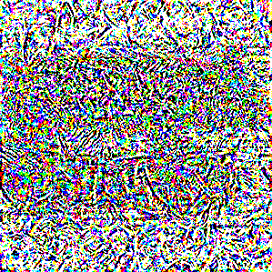
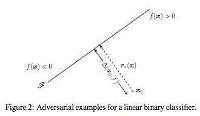
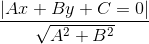
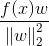
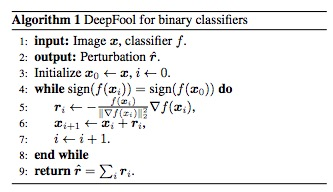
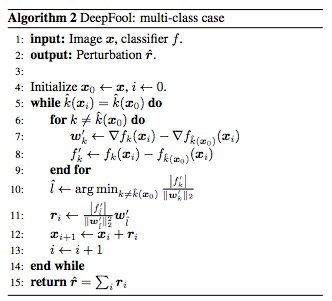
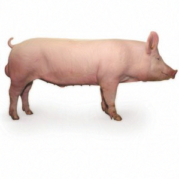
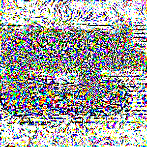

# 攻击AI模型之DeepFool算法

# 概述
在前面文章《对抗样本的基本原理》中，我们介绍了生成对抗样本的基本思路，其中大体思路分为白盒攻击和黑盒攻击，区别在于黑盒测试把模型当做黑盒，只能输入样本获得预测结果，白盒在黑盒的基础上还可以获取模型的参数、梯度等信息。本文将介绍白盒攻击中鼎鼎大名的DeepFool算法。

# DeepFool基本原理
在《攻击AI模型之FGSM算法》中，我们介绍了FGSM的基本原理。一个很好的问题就是，我们究竟对原始图像做了多大修改就可以欺骗AI模型呢？换个说法就是，如何尽量少的修改原始图像就可以达到欺骗AI模型的目的呢？首先我们先看下我们对原始图像做了哪些修改。假设我们原始图像为x0_file，对抗样本为x1_file，将原始图像保存成向量。

	#原始图像数据
    x0_img = image.load_img(x0_file, target_size=(299, 299))
    x0 = image.img_to_array(x0_img)
    
同样的方法，将对抗样本生成的图像保存成向量。

	#对抗样本数据
    x1_img = image.load_img(x1_file, target_size=(299, 299))
    x1 = image.img_to_array(x1_img)

计算原始图像和对抗样本之间的差值，转换成无符号的字节类型后保存成图像。
   
	#计算变化量
    d=x1-x0
    im = Image.fromarray(d.astype(np.uint8))
    im.save(out)

以我们经典的小猪图像为原始图像，效果如下图所示。

FGSM算法生成的对抗样本图像，效果如下图所示。

对抗样本相对原始图像的变化量，效果如下图所示。

DeepFool最早由S. Moosavi-Dezfooli, A. Fawzi,和P. Frossard在《DeepFool: a simple and accurate method to fool deep neural networks》中提出。以最简单的二分类问题为例，如图所示，假设分割平面是一个直线，直线的两侧分别对应不同的分类结果。

如果想改变其中某点的分类结果，一定要跨过分割平面。显然最短的移动距离就是垂直分割平面进行移动。在线性代数里面，点x到直线Ax+By+C=0的距离定义为：

向量化表示距离如下，其中w为参数矩阵。

推而广之，在二分类问题中，当分割平面不是线性时，我们假设当移动的距离很小时，分割平面相对该点可以认为依然是一个线性的分割平面，每次迭代时，该点都以很小的移动距离不断逼近分割平面。

由于移动距离很小，可以使用该点的梯度代替参数矩阵w。多分类问题时，与二分类问题类似，只不过在迭代计算时需要考虑该点向不同分类标签移动时要选取一定距离最短的那个。

## 攻击图像识别模型
以攻击InceptionV3模型为例，介绍生成攻击样本的基本原理。Keras内置了这个模型，我们直接使用就可以了。从模型中直接获取第一层的输入作为输入层，最后一层的输出为输出层。

	model = inception_v3.InceptionV3()
	model_input_layer = model.layers[0].input
	model_output_layer = model.layers[-1].output

然后加载我们攻击的图片，比如我们的小猪。这里需要特别强调的是，NumPy出于性能考虑，默认的变量赋值会引用同样一份内存，所以我们需要使用np.copy手工强制复制一份图像数据。

	img = image.load_img("../picture/pig.jpg", target_size=(299, 299))
	original_image = image.img_to_array(img)
	hacked_image = np.copy(original_image)

为了避免图像变化过大，超过肉眼可以接受的程度，我们需要定义阈值。

	max_change_above = original_image + 0.01
	max_change_below = original_image - 0.01

下面我们要定义最关键的三个函数了，我们定义损失函数为识别为烤面包机的概率，因此我们需要使用梯度上升算法，不断追求损失函数的最大化，变量object_type_to_fake定义的就是烤面包机对应的标签，在InceptionV3中面包机的标签为859。

	object_type_to_fake = 859

有了损失函数以后，我们就可以通过Keras的接口获取到对应的梯度函数。最后通过K.function获取一个Keras函数实例，该函数的输入列表分别为输入层和当前是训练模式还是测试模式的标记learning_phase()，输出列表是损失函数和梯度。关于K.function的使用建议阅读Keras的在线文档。

	cost_function = model_output_layer[0, object_type_to_fake]
	gradient_function = K.gradients(cost_function, model_input_layer)[0]
	grab_cost_and_gradients_from_model = 
	K.function([model_input_layer,K.learning_phase()], 
	[cost_function, gradient_function] )

除了迭代环节，DeepFool与FGSM的算法完全相同。在迭代环节，我们通过NumPy的inalg.norm函数对梯度进行处理，然后迭代更新图片内容。

	r= gradients*cost/pow(np.linalg.norm(gradients), 2)
	hacked_image +=r
	hacked_image = np.clip(hacked_image, max_change_below, max_change_above)
	hacked_image = np.clip(hacked_image, -1.0, 1.0)
	
这里需要特别介绍下linalg.norm函数，其函数原型为：

	x_norm=np.linalg.norm(x, ord=None, axis=None, keepdims=False)

其中ord表示矩阵的范数。

- ord=1，列和的最大值,第一范式
- ord=2，求特征值，然后求最大特征值得算术平方根，第二范式，也是默认值

axis表示处理类型。

- axis=1表示按行向量处理，求多个行向量的范数
- axis=0表示按列向量处理，求多个列向量的范数
- axis=None表示矩阵范数。

在我的Mac本经过2分钟27次迭代训练，获得了新的家猪图像，但是机器学习模型识别它为烤面包机的概率却达到了86.086%。

	batch:20 Cost: 18.707792%
	batch:21 Cost: 26.560178%
	batch:22 Cost: 37.765652%
	batch:23 Cost: 50.175613%
	batch:24 Cost: 65.024394%
	batch:25 Cost: 71.812165%
	batch:26 Cost: 73.846906%
	batch:27 Cost: 86.086935%

基于DeepFool算法被识别为烤面包机的家猪的图片效果如下。

计算相对原始图像的修改量，如下图所示，显然比FGSM修改量少。

# 参考文献
- S. Moosavi-Dezfooli, A. Fawzi, P. Frossard: DeepFool: a simple and accurate method to fool deep neural networks. In Computer Vision and Pattern Recognition (CVPR ’16), IEEE, 2016.
- 刘焱，《web安全之强化学习与GAN》，机械工业出版社