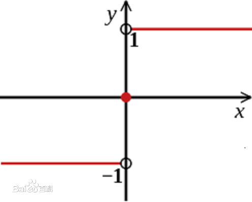
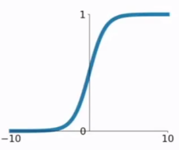
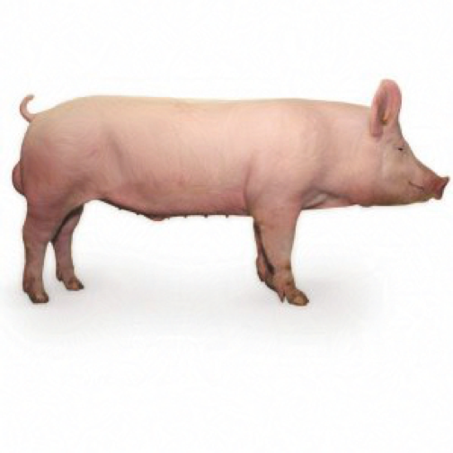
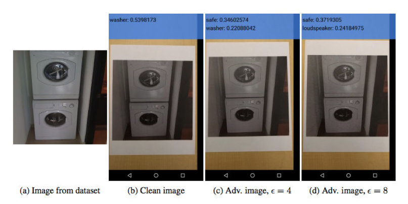

# 对抗样本算法之FGSM算法
## 概述
在前面文章《对抗样本的基本原理》中，我们介绍了生成对抗样本的基本思路，其中大体思路分为白盒攻击和黑盒攻击，区别在于黑盒测试把模型当做黑盒，只能输入样本获得预测结果，白盒在黑盒的基础上还可以获取模型的参数、梯度等信息。本文将介绍白盒攻击中鼎鼎大名的FGSM（Fast Gradient Sign Method）算法。
## FGSM基本原理
FGSM最早由Goodfellow在其论文《Explaining and Harnessing Adversarial Examples》中提出。以最常见的图像识别为例，我们希望在原始图片上做肉眼难以识别的修改，但是却可以让图像识别模型产生误判。假设图片原始数据为x，图片识别的结果为y，原始图像上细微的变化肉眼难以识别，使用数学公式表示如下。

将修改后的图像输入分类模型中，x与参数矩阵相乘。

对分类结果的影响还要受到激活函数的作用，攻击样本的生成过程就是追求以微小的修改，通过激活函数的作用，对分类结果产生最大化的变化。Goodfellow指出，如果我们的变化量与梯度的变化方向完全一致，那么将会对分类结果产生最大化的变化。

其中sign函数可以保证与梯度函数方向一致。

当x的维数为n时，模型的参数在每个维度的平均值为m，每个维度的微小修改与梯度函数方向一致，累计的效果为：

可见当原始数据的维度越大，攻击的累计效果越明显。以一个更加直观的例子来说明FGSM的原理。假设具有2000个样本，每个数据具有1000维，每维的数据的数值的大小都在0-1之间随机生成，分类标签只有2种。

	 #特征数
    n_features=1000
    x,y=datasets.make_classification(n_samples=2000,
    n_features=n_features,n_classes=2,random_state=random_state)
    #标准化到0-1之间
    x= MinMaxScaler().fit_transform(x)

分类模型是一个非常简单的多层感知机，输入层大小为1000，输出层为1，激活函数为sigmoid。

    model = Sequential()
    model.add(Dense(1,activation='sigmoid',
    input_shape=(n_features,) ) )

sigmoid函数是非常经典的激活函数，取值范围为0-1，特别适合表示概率分布。

损失函数使用最简单的mse，优化方式使用adam，考核的指标为准确度accuracy。

    model.compile(loss='mse',
                  optimizer='adam',
                  metrics=['accuracy'])

    model.summary()

完整的模型结果如下。

_________________________________________________________________
	Layer (type)                 Output Shape              Param #   
	=================================================================
	dense_1 (Dense)              (None, 1)                 1001      
	=================================================================
	Total params: 1,001
	Trainable params: 1,001
	Non-trainable params: 0
	_________________________________________________________________

批处理大小为16，经过20轮训练。

	model.fit(x,y,epochs=20,batch_size=16)

最终训练结果，损失值稳定在0.17-0.18之间，准确度为80.85%。

	Epoch 18/20
	2000/2000 [==============================] - 0s 86us/step - loss: 0.1796 - acc: 0.7690
	Epoch 19/20
	2000/2000 [==============================] - 0s 86us/step - loss: 0.1711 - acc: 0.8470
	Epoch 20/20
	2000/2000 [==============================] - 0s 87us/step - loss: 0.1718 - acc: 0.8085

由于数据是随机生成的，我们取0号举例，

    #获取第0号元素
    x0=x[0]
    y0=y[0]
    x0 = np.expand_dims(x0, axis=0)
    y0_predict = model.predict(x0)

0号数据的标签为0，内容截取如下，预测的值为0.296199。

	[[ 0.4860574   0.42001144  0.27524764  0.73457147  0.36324722  0.67289411
	0.63321704  0.71295512  0.43134776  0.74441116  0.71009115  0.6578975
	0.72477239  0.55870978  0.54932412  0.37136643  0.65307521  0.46990842

获取x0对应的梯度。

    e = 0.1
    cost, gradients = grab_cost_and_gradients_from_model([x0, 0])
    n = np.sign(gradients)
    x0 += n * e

当e取0.1时，FGSM计算的最终偏移值绝对值为0.1，即在每个维度增加或者减少0.1，具体值截取如下。

	[[-0.1 -0.1 -0.1  0.1 -0.1  0.1  0.1  0.1  0.1  0.1  0.1  0.1  0.1 -0.1
	  -0.1 -0.1  0.1 -0.1 -0.1 -0.1  0.1 -0.1 -0.1  0.1 -0.1  0.1  0.1  0.1
	  -0.1 -0.1  0.1 -0.1 -0.1 -0.1  0.1 -0.1  0.1  0.1  0.1 -0.1  0.1  0.1
	  -0.1 -0.1 -0.1  0.1  0.1  0.1 -0.1 -0.1  0.1  0.1  0.1  0.1  0.1 -0.1

叠加完得到新的x0值，由于修改量较小，可以认为对原始数据修改不大，但是预测值达到了0.984356，可以认为标签从0变成了1。

## 攻击图像识别模型
以攻击InceptionV3模型为例，介绍生成攻击样本的基本原理。Keras内置了这个模型，我们直接使用就可以了。从模型中直接获取第一层的输入作为输入层，最后一层的输出为输出层。

	model = inception_v3.InceptionV3()
	model_input_layer = model.layers[0].input
	model_output_layer = model.layers[-1].output

然后加载我们攻击的图片，比如我们的小猪。这里需要特别强调的是，NumPy出于性能考虑，默认的变量赋值会引用同样一份内存，所以我们需要使用np.copy手工强制复制一份图像数据。

	img = image.load_img("../picture/pig.jpg", target_size=(299, 299))
	original_image = image.img_to_array(img)
	hacked_image = np.copy(original_image)

为了避免图像变化过大，超过肉眼可以接受的程度，我们需要定义阈值。

	max_change_above = original_image + 0.01
	max_change_below = original_image - 0.01

下面我们要定义最关键的三个函数了，我们定义损失函数为识别为烤面包机的概率，因此我们需要使用梯度上升算法，不断追求损失函数的最大化，变量object_type_to_fake定义的就是烤面包机对应的标签，在InceptionV3中面包机的标签为859。

	object_type_to_fake = 859

有了损失函数以后，我们就可以通过Keras的接口获取到对应的梯度函数。最后通过K.function获取一个Keras函数实例，该函数的输入列表分别为输入层和当前是训练模式还是测试模式的标记learning_phase()，输出列表是损失函数和梯度。关于K.function的使用建议阅读Keras的在线文档。

	cost_function = model_output_layer[0, object_type_to_fake]
	gradient_function = K.gradients(cost_function, model_input_layer)[0]
	grab_cost_and_gradients_from_model = 
	K.function([model_input_layer,K.learning_phase()], 
	[cost_function, gradient_function] )

除了迭代环节，FGSM与基于梯度上升的算法完全相同。在迭代环节，我们通过NumPy的sign函数对梯度进行处理，然后迭代更新图片内容。

	e=0.007
	while cost < 0.60:
		cost, gradients = grab_cost_and_gradients_from_model([hacked_image, 0])
		n=np.sign(gradients)
		hacked_image +=n*e
		hacked_image = np.clip(hacked_image, max_change_below, max_change_above)
		hacked_image = np.clip(hacked_image, -1.0, 1.0)
		print("batch:{} Cost: {:.8}%".format(index,cost * 100))
		index+=1

在我的Mac本经过2分钟16次迭代训练，获得了新的家猪图像，但是机器学习模型识别它为烤面包机的概率却达到了74.31%，迭代次数明显减少。

	batch:11 Cost: 2.7044188%
	batch:12 Cost: 16.616838%
	batch:13 Cost: 38.806009%
	batch:14 Cost: 52.693129%
	batch:15 Cost: 38.372087%
	batch:16 Cost: 74.312818%

基于FGSM算法被识别为烤面包机的家猪（概率为74.31%）的图片效果如下。

由于我们设置的退出条件是概率大于60%，所以FGSM没有继续迭代下去，我们通过设置阈值可以得到概率更大的图片，在进一步的实验中我们通过37次迭代得到了概率为99.56%的攻击图片。

	batch:34 Cost: 97.030985%
	batch:35 Cost: 90.346575%
	batch:36 Cost: 63.920081%
	batch:37 Cost: 99.558592%

基于FGSM算法被识别为烤面包机的家猪（概率为99.56%）的图片效果如下。

Ian Goodfellow在他的论文《Adversarial examples in the physical world》中指出，针对图像的攻击方式在现实生活中也可以发生，攻击图片经过拍照打印后依然可以欺骗图像分类模型，系统错把“洗衣机”标签为“保险箱”。

# 参考文献
- Ian J. Goodfellow, Jonathon Shlens & Christian Szegedy，Explaining and Harnessing Adversarial Examples，arXiv:1412.6572
- Alexey Kurakin, Ian Goodfellow, Samy Bengio，Adversarial examples in the physical world，arXiv:1607.02533
- https://baike.baidu.com/item/sign/115763
- 刘焱，《web安全之强化学习与GAN》，机械工业出版社